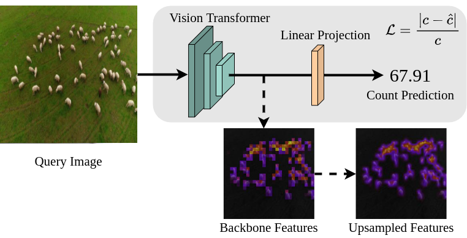

# Learning To Count Anything: Reference-less Class-agnostic Counting with Weak Supervision
**[Project Page](https://countinganything.active.vision/) |
[Latest arXiv](https://arxiv.org/abs/2205.10203)**

[Michael Hobley](https://scholar.google.co.uk/citations?user=2EftbyIAAAAJ&hl=en), 
[Victor Adrian Prisacariu](http://www.robots.ox.ac.uk/~victor/). 

[Active Vision Lab (AVL)](https://www.robots.ox.ac.uk/~lav/),
University of Oxford.




## Update
#### Sept 2022
Updated code release our corresponding to [arXiv paper v2](https://arxiv.org/abs/2205.10203) with:
  1. Feature Backbone training and a single linear projection, increasing the accuracy of our method.
  2. Localisation from an additional head.
  3. FSC-133, a propose dataset which removes errors, ambiguities, and repeated images from FSC-147.
  4. Released [model checkpoints](https://drive.google.com/drive/folders/1WdMk98Ujw-QWbYwRNLzQ0jxiqi4Hpt8-?usp=sharing).

#### Jul 2022
Initial code release, corresponding to [arXiv paper v1](https://arxiv.org/abs/2205.10203v1).


## Environment

We provide a `environment.yml` file to set up a `conda` environment:

```sh
git clone https://github.com/ActiveVisionLab/LearningToCountAnything.git
cd LearningToCountAnything
conda env create -f environment.yml
```

## Dataset Download 
### FSC-147
The data is the same as in [Learning To Count Everything, Ranjan et al.](https://github.com/cvlab-stonybrook/LearningToCountEverything) as are the annotation, image class and train/test/val split files we include.

Dowload [FSC-147 Images](https://drive.google.com/file/d/1ymDYrGs9DSRicfZbSCDiOu0ikGDh5k6S/view?usp=sharing) and the [precomputed density maps](https://archive.org/details/FSC147-GT).

If you are not using `data/` then specify your data_path directory in `configs/_DEFAULT.
yml`.


```
data/FSC-147
├── annotation_FSC147_384.json
├── ImageClasses_FSC147.txt
├── gt_density_map_adaptive_384_VarV2
│   ├── 2.npy
│   ├── 3.npy
│   ├── ...
├── images_384_VarV2
│   ├── 2.jpg
│   ├── 3.jpg
│   ├── ...
└── Train_Test_Val_FSC_147.json
```

### FSC-133
As discussed in the paper, we found FSC-147 contained 448 non-unique images. Some of the duplicated images appear with different associated counts, and/or in the training set and one
of the validation or testing sets.
We propose FSC-133, which removes these errors, ambiguities, and repeated images from FSC-147. 

As FSC-133 is a subset of FSC-147 the images and precomputed density maps are as above. The annotations, class labels and data splits have been updated.

```
data/FSC-133
├── annotation_FSC133_384.json
├── ImageClasses_FSC133.txt
├── gt_density_map_adaptive_384_VarV2
│   ├── 2.npy
│   ├── 3.npy
│   ├── ...
├── images_384_VarV2
│   ├── 2.jpg
│   ├── 3.jpg
│   ├── ...
└── Train_Test_Val_FSC_133.json
```
## Trained Model Download 
We provide [example weights](https://drive.google.com/drive/folders/1WdMk98Ujw-QWbYwRNLzQ0jxiqi4Hpt8-?usp=sharing)
 for our models trained on FSC-133.

 ```
logs/examples
├── counting.ckpt
└── localisation.ckpt
```

## Example Training 

To train the counting network:
```sh
python main.py --config example_training
```

To train the localisation head (purely for visualisation), given a trained counting network:
To train the counting network:
```sh
python main.py --config example_localisation_training
```

## Example Testing
To test a trained model on the validation set: 

```sh
python main.py --config example_test --val
```
To test a trained model on the test set: 

```sh
python main.py --config example_test --test
```

## Example Visualisation
To view the localisation via feature PCA, saved to output/pca: 
```sh
python main.py --config example_pca_vis --val
```

To view the localisation head's predictions, saved to output/heatmap: 
```sh
python main.py --config example_localisation_vis --val
```


## Citation

If you find the code or FSC-133 useful, please cite:
```

@article{hobley2022-LTCA,
  title={Learning to Count Anything: Reference-less Class-agnostic Counting with Weak Supervision},
  author={Hobley, Michael and Prisacariu, Victor},
  journal={arXiv preprint arXiv:2205.10203},
  year={2022}
}
```
