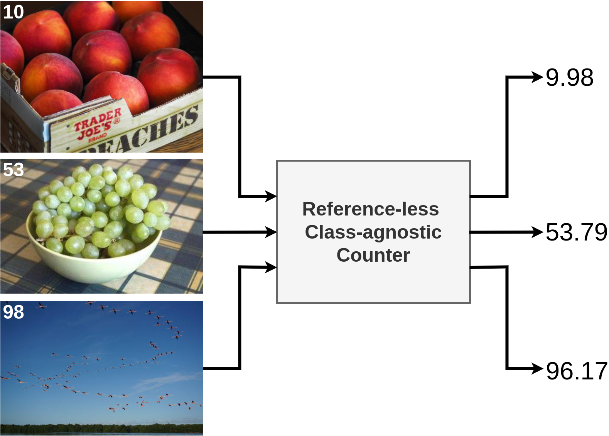

# Learning To Count Anything


This is the official implementation of:
```
Learning to Count Anything: Reference-less Class-agnostic Counting with Weak Supervision
Michael Hobley, Victor Prisacariu
```
Link to arxiv preprint: https://arxiv.org/pdf/2205.10203.pdf


## Environment

We provide a `environment.yml` file to set up a `conda` environment:

```sh
git clone https://github.com/ActiveVisionLab/LearningToCountAnything.git
cd LearningToCountAnything
conda env create -f environment.yml
```

## Dataset download 
### FSC-147
The data is the same as in [Learning To Count Everything, Ranjan et al.](https://github.com/cvlab-stonybrook/LearningToCountEverything) as are the annotation, image class and train/test/val split files we include.

Dowload [FSC-147 Images](https://drive.google.com/file/d/1ymDYrGs9DSRicfZbSCDiOu0ikGDh5k6S/view?usp=sharing) and the [precomputed density maps](https://archive.org/details/FSC147-GT).

If you are not using `data/` then specify your data_path directory in `configs/_DEFAULT.
yml`.


```
data/FSC-147
├── annotation_FSC147_384.json
├── ImageClasses_FSC147.txt
├── gt_density_map_adaptive_384_VarV2
│   ├── 2.npy
│   ├── 3.npy
│   ├── ...
├── images_384_VarV2
│   ├── 2.jpg
│   ├── 3.jpg
│   ├── ...
└── Train_Test_Val_FSC_147.json
```

### COCO
As discussed in our work we do not think COCO should be used to evaluate counting tasks, however, as Yang et al. use it in 'Class-agnostic Few-shot Object Counting' we include it here for comparision.
Download [Coco 2017](http://cocodataset.org/).

```
data/coco
├── coco_id_cats_count.json
└── val2017
    ├── 000000000139.jpg
    ├── 000000000285.jpg
    ├── ...
```


## Example Training 

```sh
python main.py --config example
```

## Example Testing
To test a trained model on the validation set: 

```sh
python main.py --config example --val
```
To test a trained model on the test set: 

```sh
python main.py --config example --test
```

## Citation

If you find the code useful, please cite:
```

@article{hobley2022-LTCA,
  title={Learning to Count Anything: Reference-less Class-agnostic Counting with Weak Supervision},
  author={Hobley, Michael and Prisacariu, Victor},
  journal={arXiv preprint arXiv:2205.10203},
  year={2022}
}
```
